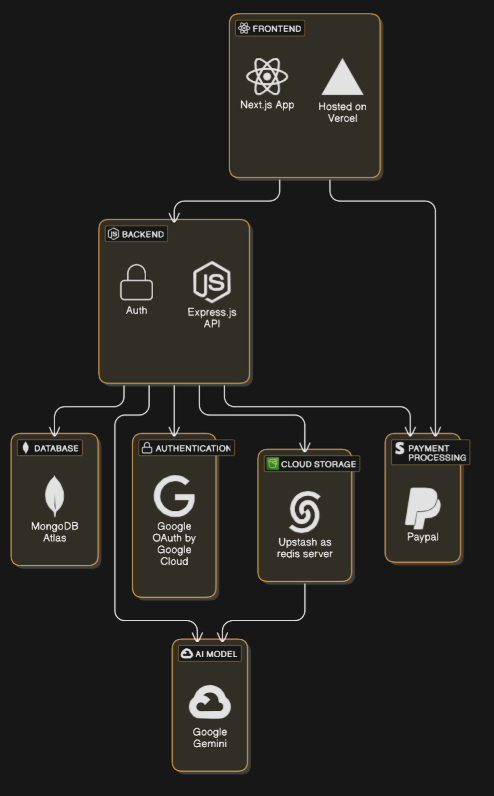
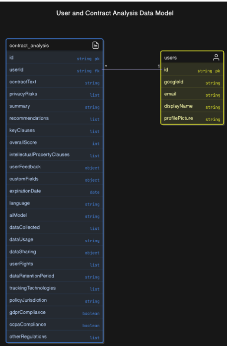

# 🛡️ Sanrakshan – Privacy Policy Analyzer

## 🔗 Project Resources

🎥 **Demo Video:** [Watch on YouTube](https://youtu.be/n-zGngF6uJ4)  
📄 **SRS Document:** [View PDF](assets/SRS.pdf)

---

## 🧠 How We Got the Idea

While browsing through tech news, I came across numerous articles and reports about companies secretly collecting user data through their privacy policies. One notable example was Adobe, which was found collecting user photos and videos to train their AI models—often without explicit user awareness. This raised serious concerns about how much power and access these documents give to corporations. That's when we decided to build **Sanrakshan**, a tool to empower users by helping them **analyze privacy policies before agreeing to them.**

---

## 📘 What is Sanrakshan?

**Sanrakshan** is a powerful privacy policy analyzer that helps you understand exactly what a company intends to do with your data. Just upload a privacy policy in **PDF format**, and the system will:

- Analyze and **classify the content**
- Assign a **risk score**
- Provide a **brief overview**
- Highlight **data collection and handling practices**
- Offer **recommendations** based on potential concerns

---

## 🎯 Who is Sanrakshan For?

Sanrakshan is built for:

- **Privacy-conscious users** who want to make informed decisions
- **Researchers and developers** analyzing legal contracts
- **Everyday users** who don’t have the time or legal background to read through long privacy policies

If you’re the kind of person who asks, *“What am I really agreeing to?”*, Sanrakshan is for you.

---

## 🏗️ Architecture & Diagrams


- **Tech Architecture**



- **Database Diagram**





---

## 🚀 How to Run the Project

To run the project locally, configure the `.env` files for both the client and server:

### 🛠️ Server `.env` Variables

```env
MONGODB_URI=
GOOGLE_CLIENT_ID=
GOOGLE_CLIENT_SECRET=
CLIENT_URL=
SESSION_SECRET=
UPSTASH_REDIS_REST_URL=
UPSTASH_REDIS_REST_TOKEN=
GEMINI_API_KEY=
RESEND_API_KEY=
PAYPAL_CLIENT_ID=
PAYPAL_SECRET=
```

### 🛠️ Client `.env` Variables

```env
NEXT_PUBLIC_API_URL=
```

Then run:

```bash
# For server
cd server
npm install
npm start

# For client
cd client
npm install
npm run dev
```

---

## 🧪 Approaches We Used to Build Sanrakshan

### 1️⃣ Gemini AI API Approach

Initially, we leveraged the **Gemini AI API** to analyze policies, assess risks, assign scores, and provide recommendations. While Gemini gave meaningful insights, it lacked **scoring consistency**—the same document would often receive different results on multiple uploads.

### 2️⃣ Custom Model Approach

To address this, we trained our **own model** using **Legal-BERT**, fine-tuned specifically to classify privacy policy content into predefined categories and assign **consistent severity scores**.

---

## ❓ Why We Built Our Own Model

1. **LLMs Are Not Deterministic**  
   Gemini doesn’t always produce the same output for the same input.

2. **No Standardized Scoring**  
   General-purpose models aren’t optimized for legal document scoring.

3. **Context Dependence**  
   Risk analysis varies too much based on prompt phrasing or context.

4. **Temperature and Randomness**  
   Higher temperature in LLMs adds randomness, which affects reliability.
   
---

## 🧠 Model Link

You can explore **our fine-tuned model**, trained specifically for privacy policy classification and severity scoring:  
🔗 [Sanrakshan Custom Model](https://huggingface.co/Sanrakshan/Sanrakshan_AI)

This model is based on Legal-BERT and has been fine-tuned to understand and categorize privacy policies with consistent and reliable predictions.

--- 


## 👥 Contributors

Developed with 💙, curiosity, and a deep concern for user privacy by:

- [Nisarg Amlani](https://github.com/Nisarg155/)
- [Kavya Shah](https://github.com/Kavyashah26)

> Built to empower users, spark awareness, and make digital spaces a little safer—one privacy policy at a time.

--- 


